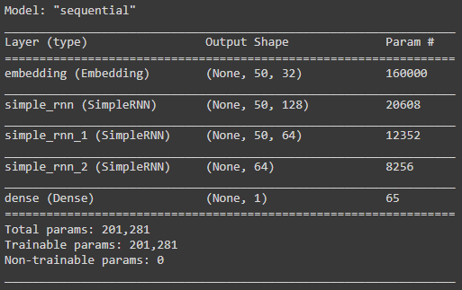

# Twitter Sentiment Analysis using RNN
### **Data Visualization**

The dataset contains two columns and 10315 rows. The first column is the tweets and the second column is
sentiment which represents which class the tweet belongs to(0/1).

From label count of the sentiment we can see that most of the sentiments are labeled as 0 (positive).

 

### **Data pre-processing**

For pre-processing, some steps have been taken such as removing most frequent words, removing of punctuation,
removing address id.

### **Model**

### **Results**

The comparison between (accuracy and validation accuracy) and (loss and validation loss) can be visualized
by plotting graph which is shown below:

 

Here are the different scores:

### **Prediction**

